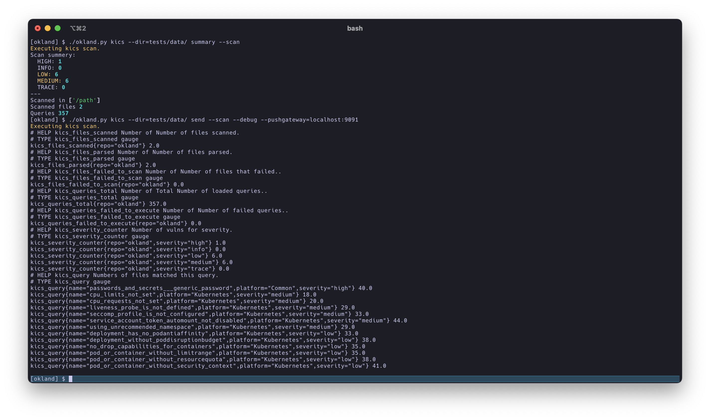

# okland

okland is a python wrapper for handling static code analysis toolings. most promiment feature is it's ability to extract prometheus metrics from results and send them to a pushgateway.

## supported toolings

- kics.io