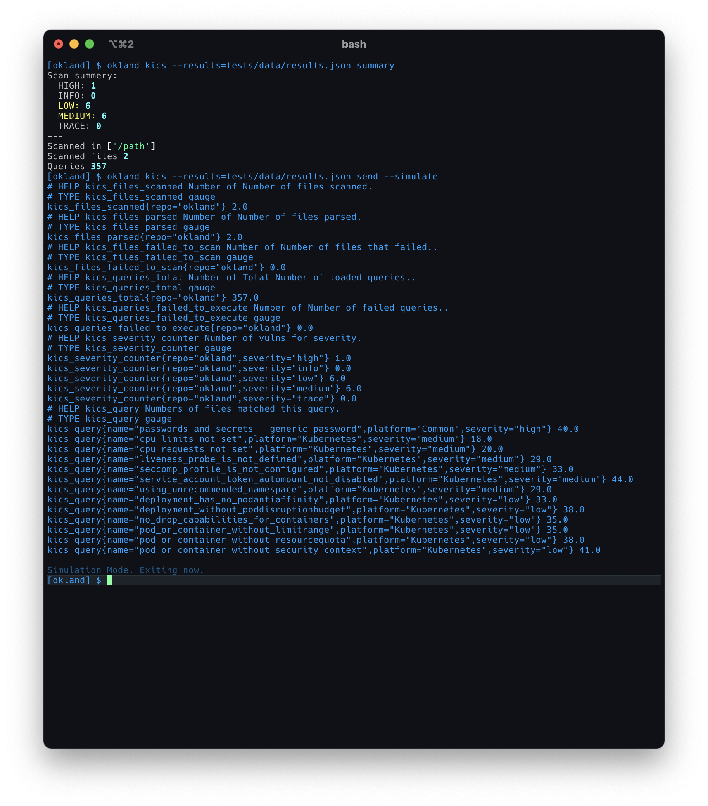

# okland

okland is a cli wrapper for handling static code analysis toolings. it's core feature is the ability to extract prometheus metrics from scan results and send them to a pushgateway.



## installation

you can find a pypi package at https://pypi.org/project/okland/ 

```bash
$ pip3 install okland
$ okland --help
```

## usage

Execute a kics scan in a custom directory:

```bash
$ okland kics send --dir my-kube-manifests/ --pushgateway=localhost:9091 --jobname=okland_kics --scan --debug
Executing kics scan.
(...)
```

each subcommand should contain a meaningful `--help`.

## supported toolings

- kics.io